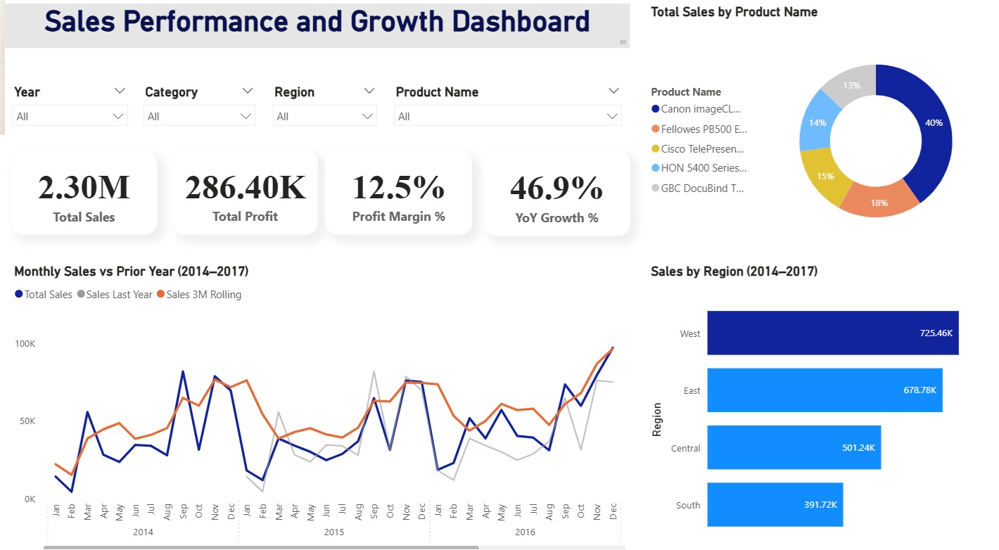

# Sales Performance Dashboard

## Project Overview
This project presents an interactive Sales Performance Dashboard developed in Power BI to analyse revenue trends, profitability, and regional performance. The dashboard enables data-driven decision-making by providing clear visibility of key business metrics and performance indicators.

The objective of this project was to transform raw transactional sales data into meaningful insights through data modelling, DAX calculations, and interactive visualisation.

---

## Tools & Technologies
- Power BI Desktop  
- DAX (Data Analysis Expressions)  
- Data Modelling  
- Data Cleaning & Transformation  

---

## Key KPIs
- Total Revenue  
- Total Profit  
- Profit Margin (%)  
- Year-on-Year (YoY) Growth  
- Sales by Region  
- Top Performing Products  
- Monthly Revenue Trend  

---

## Dashboard Features
- Interactive slicers for dynamic filtering  
- Drill-through analysis by region and product  
- KPI cards for executive-level reporting  
- Trend analysis with time-based comparisons  
- Visual breakdown of revenue and profitability  

---

## Business Insights
The dashboard enables:
- Identification of high-performing regions and products  
- Analysis of revenue growth trends over time  
- Performance comparison across business segments  
- Faster executive decision-making through real-time KPI visibility  

---

## Files Included
- `Sales_Performance_Dashboard.pbix` – Power BI report file  
- `images/` – Dashboard screenshots  
- `data/` – Sample dataset used for analysis  

---

## Screenshots

---

## Future Improvements
- Add forecast modelling for sales prediction  
- Implement customer segmentation analysis  
- Automate data refresh integration  

---
